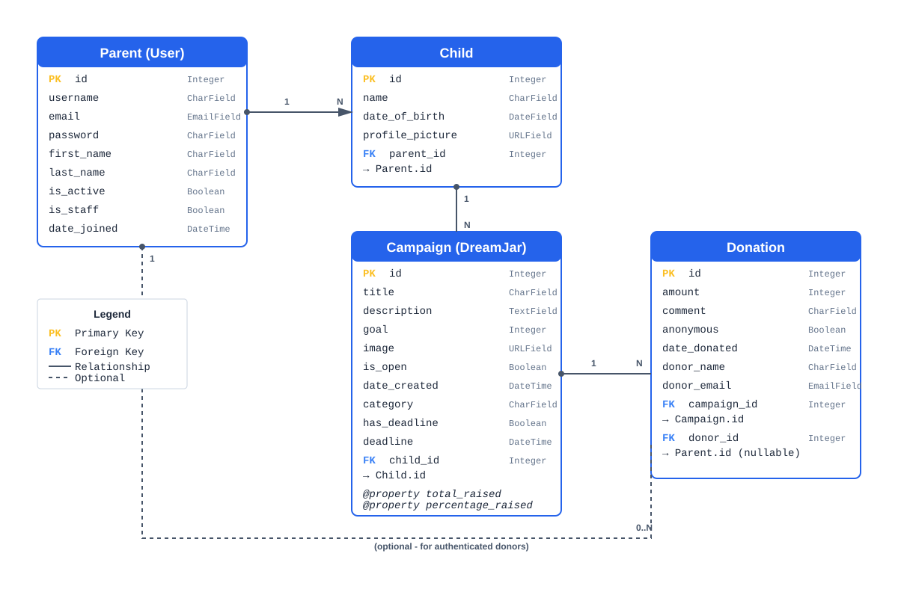
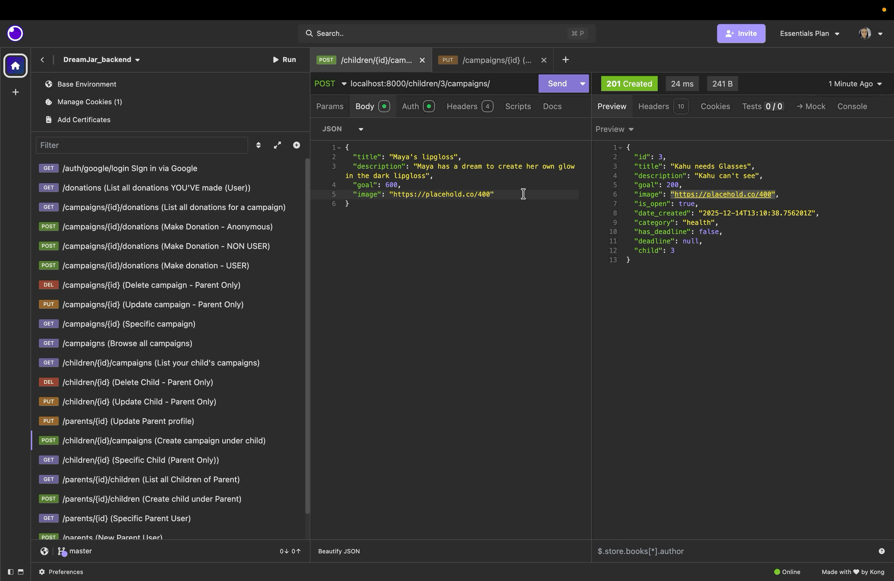
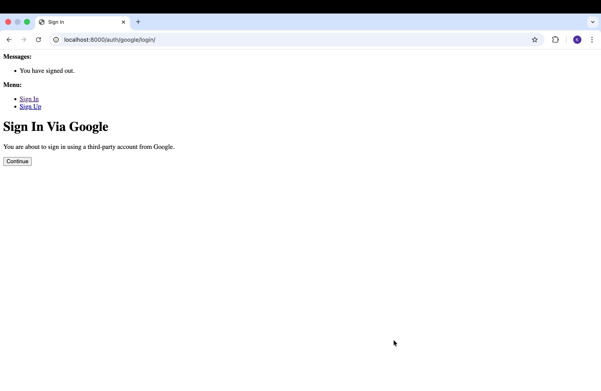

# DreamJar - Crowdfunding Backend

Kaycee Lawrence

## Contents

- [DreamJar - Crowdfunding Backend](#dreamjar---crowdfunding-backend)
  - [Contents](#contents)
  - [1. Deployed Project](#1-deployed-project)
  - [2. Project Overview](#2-project-overview)
  - [3. Concept](#3-concept)
    - [3.1. Campaign Categories](#31-campaign-categories)
    - [3.2. How It Works](#32-how-it-works)
  - [4. Target Audience](#4-target-audience)
  - [5. Tech Stack](#5-tech-stack)
  - [6. Core Features](#6-core-features)
  - [7. User Stories](#7-user-stories)
  - [8. User Accounts \& Authentication](#8-user-accounts--authentication)
    - [8.1. User Model](#81-user-model)
    - [8.2. Authentication Methods](#82-authentication-methods)
  - [9. User Access Rules](#9-user-access-rules)
  - [10. Anonymous Donations](#10-anonymous-donations)
  - [11. Campaign Logic](#11-campaign-logic)
    - [11.1. Dynamic Campaign Properties](#111-dynamic-campaign-properties)
    - [11.2. Campaign Deadlines](#112-campaign-deadlines)
  - [12. Front End Pages/Functionality](#12-front-end-pagesfunctionality)
    - [12.1. Parent Dashboard](#121-parent-dashboard)
    - [12.2. Child Management](#122-child-management)
    - [12.3. Campaign Management](#123-campaign-management)
    - [12.4. Public Campaign Browser](#124-public-campaign-browser)
    - [12.5. Donation Features](#125-donation-features)
  - [13. API Specification](#13-api-specification)
    - [13.1. Authentication](#131-authentication)
    - [13.2. Parents (Users)](#132-parents-users)
    - [13.3. Children](#133-children)
    - [13.4. Campaigns](#134-campaigns)
    - [13.5. Donations](#135-donations)
  - [14. Database Schema](#14-database-schema)
    - [14.1. Parent (Custom User Model)](#141-parent-custom-user-model)
    - [14.2. Child](#142-child)
    - [14.3. Campaign](#143-campaign)
    - [14.4. Donation](#144-donation)
  - [15. Insomnia API Testing Evidence](#15-insomnia-api-testing-evidence)
    - [15.1. Successful GET Request](#151-successful-get-request)
    - [15.2. Successful POST Request](#152-successful-post-request)
    - [15.3. Token Authentication Response](#153-token-authentication-response)
    - [15.4. Google OAuth Response](#154-google-oauth-response)


## 1. Deployed Project

🔗 **Live API:**  
`https://dreamjar-backend-92db4d7e1c70.herokuapp.com`

## 2. Project Overview

DreamJar is a Django REST Framework API that enables parents to create crowdfunding campaigns for their children's dreams and goals. The platform is designed specifically for children under 16, with parents managing accounts and campaigns on their behalf.

The API implements robust authentication, permissions, and validation to ensure child safety and data privacy while allowing the community to support children's aspirations.

**For step by step usage guide, [click here](./userguide.md)**

## 3. Concept

DreamJar is a **child-focused crowdfunding platform** that helps families fund their children's dreams, goals, and opportunities.

Many children have aspirations that require financial support - whether it's sports equipment, educational programs, hobby development, health needs, or special experiences. DreamJar provides a safe, parent-controlled platform where:

- **Parents create and manage accounts** for their children
- **Each child can have multiple campaigns** (called "DreamJars") for different goals
- **The community can donate** to support children's dreams
- **Privacy is protected** - only the child's first name is shown publicly

### 3.1. Campaign Categories

- **Sports** - Equipment, training, team fees, competitions
- **Education** - Tutoring, courses, educational materials, school trips
- **Hobbies** - Musical instruments, art supplies, hobby equipment
- **Health** - Medical equipment, therapy, health programs
- **Dreams** - Special experiences, opportunities, general aspirations

### 3.2. How It Works

1. **Parents register** and create profiles for their children (under 16)
2. **Parents create campaigns** for each child's specific goal
3. **Community members donate** - either with an account or anonymously
4. **Parents manage** their children's campaigns and track progress
5. **Funds are raised** to help children achieve their dreams

## 4. Target Audience

- **Parents** seeking support for their children's goals and dreams
- **Family members** wanting to contribute to their relatives' aspirations
- **Community donors** interested in supporting local children
- **Friends and neighbors** who want to help children in their community
- **Organizations** supporting youth development and opportunities

## 5. Tech Stack

- **Django 5.2.7**
- **Django REST Framework**
- **Django REST Framework SimpleJWT** - JWT token authentication
- **django-allauth** - Social authentication (Google OAuth)
- **django-cors-headers** - CORS support for frontend integration
- **dj-database-url** - PostgreSQL deployment support
- **WhiteNoise** - Static file serving
- **python-dotenv** - Environment variable management

## 6. Core Features

- **Secure parent registration and authentication**
- **JWT token-based API access**
- **Google OAuth integration** for easy signup
- **Parent-child account hierarchy** with strict permissions
- **Campaign (DreamJar) creation and management**
- **Public campaign browsing** with privacy protection
- **Authenticated and anonymous donations**
- **Real-time progress tracking** with dynamic properties
- **Campaign deadlines and expiration** tracking
- **Child age validation** (must be under 16)
- **Campaign closure controls** to stop accepting donations

## 7. User Stories

**Parent Account Management**

- As a parent, I want to register an account so I can create campaigns for my children
- As a parent, I want to log in using Google OAuth for quick access
- As a parent, I want to view and edit my profile information
- As a parent, I want my password to be securely stored

**Child Management**

- As a parent, I want to create profiles for my children
- As a parent, I want to ensure only children under 16 can have profiles
- As a parent, I want to edit my children's information
- As a parent, I want to delete a child's profile if they have no active campaigns

**Campaign (DreamJar) Management**

- As a parent, I want to create multiple campaigns for each of my children
- As a parent, I want to set a funding goal for each campaign
- As a parent, I want to categorize campaigns (sports, education, etc.)
- As a parent, I want to add a deadline to create urgency
- As a parent, I want to see real-time progress on fundraising goals
- As a parent, I want to close a campaign when the goal is reached
- As a parent, I want to edit campaign details if needed

**Public Campaign Browsing**

- As a visitor, I want to browse all open campaigns without logging in
- As a visitor, I want to see only the child's first name for privacy
- As a visitor, I want to see campaign progress and donation counts
- As a visitor, I want to filter campaigns by category

**Donations**

- As a donor, I want to donate to campaigns with or without an account
- As a donor, I want to leave an encouraging comment
- As a donor, I want to donate anonymously if I prefer privacy
- As a registered donor, I want to view my donation history
- As a donor, I want to know if a campaign has reached its goal


## 8. User Accounts & Authentication

### 8.1. User Model

DreamJar uses a **custom user model** (`Parent`) that extends Django's `AbstractUser`:

- **Email-based authentication** (email is the USERNAME_FIELD)
- Each parent can have **multiple children**
- Each child can have **multiple campaigns**
- Parents have full control over their children's profiles and campaigns

### 8.2. Authentication Methods

**1. JWT Token Authentication**

```
POST /api/token/
POST /api/token/refresh/
```

Tokens must be included in the Authorization header:

```
Authorization: Bearer <your_access_token>
```

**2. Google OAuth**

```
GET /auth/google/login/
GET /api/auth/google/callback/
```

Returns JWT tokens upon successful authentication.

**3. Session Authentication**

Available for development and browsable API access.

## 9. User Access Rules

| Action | Who Can Do It |
| --- | --- |
| Register a parent account | Anyone |
| View parent profile | The parent themselves |
| Edit parent profile | The parent themselves |
| Create a child | The child's parent only |
| View child details | The child's parent only |
| Edit child details | The child's parent only |
| Delete child | The child's parent only (no active campaigns) |
| Create a campaign | The child's parent only |
| View campaign (full details) | The child's parent (owner view) |
| View campaign (limited) | Anyone (public view) |
| Edit campaign | The campaign owner (parent) only |
| Delete campaign | The campaign owner (parent) only |
| Make a donation | Anyone (authenticated or anonymous) |
| View donation history | The donor (authenticated users only) |
| Browse public campaigns | Anyone |

> **Note:** Children cannot be deleted if they have active (open) campaigns.

## 10. Anonymous Donations

Donations can be made with or without a user account:

**Authenticated Donations:**
- Automatically linked to the donor's account
- Donor can view their donation history
- Donor information stored in the `donor` field

**Anonymous Donations:**
- No account required
- Donor must provide name and email
- Optional `anonymous` flag to hide donor name publicly
- Donor information stored in `donor_name` and `donor_email` fields

When the `anonymous` flag is `true`:
- The public API returns `"donor_name": "Anonymous"`
- The donor's real identity is protected
- Campaign owners can still see anonymous donations in their lists

## 11. Campaign Logic

Each campaign includes several **computed properties** that are calculated dynamically:

### 11.1. Dynamic Campaign Properties

| Property | Description |
| --- | --- |
| `total_raised` | Sum of all donations for the campaign |
| `donation_count` | Number of donations received |
| `percentage_raised` | Percentage of goal reached (rounded to 1 decimal) |
| `is_expired` | Whether the campaign has passed its deadline |
| `seconds_remaining` | Time remaining until deadline (or null if no deadline) |

### 11.2. Campaign Deadlines

Campaigns can have optional deadlines:
- Set `has_deadline = true` and provide a `deadline` timestamp
- The `is_expired` property automatically tracks if the deadline has passed
- The `seconds_remaining` property shows time left in real-time
- Parents can close campaigns manually by setting `is_open = false`

**Note:** The API does not automatically close campaigns when deadlines expire. This gives parents flexibility to extend or manually close campaigns.

## 12. Front End Pages/Functionality

### 12.1. Parent Dashboard

- View all children associated with the account
- View all campaigns across all children
- Quick access to create new child profiles and campaigns
- Profile management and settings

### 12.2. Child Management

- Create new child profiles with name, date of birth, and photo
- View list of all children
- Edit child information
- Delete children (only if no active campaigns)
- Age validation (must be under 16)

### 12.3. Campaign Management

- Create new campaigns for each child
- View full campaign details including all donations
- Edit campaign information (title, description, goal, image)
- Set optional deadlines with countdown timer
- Close campaigns manually
- Track real-time progress with percentage and total raised
- View complete donation list with donor information

### 12.4. Public Campaign Browser

- Browse all open campaigns
- Filter by category (sports, education, hobbies, health, dreams)
- View limited campaign details (sensitive information unavailable)
- See progress bars and funding statistics
- View public donation list (respecting anonymous preferences)
- Sort by newest, most funded, or closest to goal

### 12.5. Donation Features

- Donate with or without an account
- Leave optional comments
- Choose to donate anonymously
- View personal donation history (authenticated users)
- Receive confirmation after donation
- Cannot donate to closed campaigns

## 13. API Specification

### 13.1. Authentication

| URL | Method | Purpose | Request Body | Response | Auth |
| --- | --- | --- | --- | --- | --- |
| `/api/token/` | POST | Obtain JWT token pair | `{ "email", "password" }` | `{ "access", "refresh" }` | Public |
| `/api/token/refresh/` | POST | Refresh access token | `{ "refresh" }` | `{ "access" }` | Public |
| `/auth/google/login/` | GET | Initiate Google OAuth | — | Redirect to Google | Public |
| `/api/auth/google/callback/` | GET | Google OAuth callback | — | `{ "user", "access", "refresh" }` | Public |

### 13.2. Parents (Users)

| URL | Method | Purpose | Request Body | Response | Auth |
| --- | --- | --- | --- | --- | --- |
| `/parents/` | POST | Register parent account | `{ "username", "email", "password" }` | **201** + JWT tokens | Public |
| `/parents/<id>/` | GET | Get parent profile | — | **200** | Self only |
| `/parents/<id>/` | PUT | Update parent profile | `{ "username?", "email?", ... }` | **200** | Self only |

### 13.3. Children

| URL | Method | Purpose | Request Body | Response | Auth |
| --- | --- | --- | --- | --- | --- |
| `/parents/<id>/children/` | GET | List parent's children | — | **200** | Parent only |
| `/parents/<id>/children/` | POST | Create child | `{ "name", "date_of_birth", "profile_picture?" }` | **201** | Parent only |
| `/children/<id>/` | GET | Get child details | — | **200** | Parent only |
| `/children/<id>/` | PUT | Update child | `{ "name?", "date_of_birth?", "profile_picture?" }` | **200** | Parent only |
| `/children/<id>/` | DELETE | Delete child | — | **204** | Parent only (no active campaigns) |

### 13.4. Campaigns

| URL | Method | Purpose | Request Body | Response | Auth |
| --- | --- | --- | --- | --- | --- |
| `/campaigns/` | GET | Browse all open campaigns (public) | — | **200** | Public |
| `/children/<id>/campaigns/` | GET | List child's campaigns (owner) | — | **200** | Parent only |
| `/children/<id>/campaigns/` | POST | Create campaign | `{ "title", "description", "goal", "category", "image?", "has_deadline?", "deadline?", "is_open" }` | **201** | Parent only |
| `/campaigns/<id>/` | GET | Get campaign details | — | **200** (detailed for owner, limited for public) | Public |
| `/campaigns/<id>/` | PUT | Update campaign | `{ "title?", "description?", "goal?", "is_open?", ... }` | **200** | Owner only |
| `/campaigns/<id>/` | DELETE | Delete campaign | — | **204** | Owner only |

### 13.5. Donations

| URL | Method | Purpose | Request Body | Response | Auth |
| --- | --- | --- | --- | --- | --- |
| `/campaigns/<id>/donations/` | GET | List campaign donations | — | **200** | Public |
| `/campaigns/<id>/donations/` | POST | Make donation | `{ "amount", "comment?", "anonymous?", "donor_name"*, "donor_email"* }` | **201** | Public (name/email required if not authenticated) |
| `/donations/` | GET | View your donation history | — | **200** | Auth required |

\* Required for anonymous (non-authenticated) donations


## 14. Database Schema

### 14.1. Parent (Custom User Model)

| Field | Type | Notes |
| --- | --- | --- |
| id | Primary Key | Auto-generated |
| username | CharField | Required, min 3 characters |
| email | EmailField | Required, unique, used for login |
| password | CharField | Hashed, min 8 characters |
| first_name | CharField | Optional |
| last_name | CharField | Optional |
| is_active | BooleanField | Django default |
| is_staff | BooleanField | Django default |
| date_joined | DateTimeField | Auto-generated |

**Relationships:**
- One parent → Many children

---

### 14.2. Child

| Field | Type | Notes |
| --- | --- | --- |
| id | Primary Key | Auto-generated |
| name | CharField | Required, min 2 characters |
| date_of_birth | DateField | Required, must be under 16 years old |
| profile_picture | URLField | Optional |
| parent | ForeignKey(Parent) | Required, CASCADE delete |

**Relationships:**
- Many children → One parent
- One child → Many campaigns

**Validation:**
- Child must be under 16 years old
- Child cannot be deleted if they have active campaigns

---

### 14.3. Campaign

| Field | Type | Notes |
| --- | --- | --- |
| id | Primary Key | Auto-generated |
| title | CharField | Required, max 200 characters |
| description | TextField | Required |
| goal | IntegerField | Required, must be > 0 and <= 100,000 |
| image | URLField | Optional |
| is_open | BooleanField | Default: True |
| date_created | DateTimeField | Auto-generated |
| category | CharField | Choices: sports, education, hobbies, health, dreams |
| has_deadline | BooleanField | Default: False |
| deadline | DateTimeField | Optional |
| child | ForeignKey(Child) | Required, CASCADE delete |

**Computed Properties (read-only):**
- `total_raised` - Sum of all donations
- `donation_count` - Number of donations
- `percentage_raised` - (total_raised / goal) × 100
- `is_expired` - True if past deadline
- `seconds_remaining` - Seconds until deadline (or None)

**Relationships:**
- Many campaigns → One child
- One campaign → Many donations

---

### 14.4. Donation

| Field | Type | Notes |
| --- | --- | --- |
| id | Primary Key | Auto-generated |
| amount | IntegerField | Required, must be > 0 and <= 100,000 |
| comment | CharField | Optional, max 200 characters |
| anonymous | BooleanField | Default: False |
| date_donated | DateTimeField | Auto-generated |
| campaign | ForeignKey(Campaign) | Required, CASCADE delete |
| donor | ForeignKey(Parent) | Optional (null for anonymous donations) |
| donor_name | CharField | Optional, required for anonymous donations |
| donor_email | EmailField | Optional, required for anonymous donations |

**Relationships:**
- Many donations → One campaign
- Many donations → One donor (optional)

**Business Logic:**
- Cannot donate to closed campaigns
- Authenticated users: donor field auto-populated
- Anonymous users: must provide donor_name and donor_email
- If `anonymous = True`, public API shows "Anonymous"

---

**Entity Relationship Diagram:**



---

## 15. Insomnia API Testing Evidence

The following screenshots demonstrate successful API interactions using Insomnia.

### 15.1. Successful GET Request

Example: Retrieving public campaigns


---

### 15.2. Successful POST Request

Example: Creating a new campaign for your child



---

### 15.3. Token Authentication Response

Example: Obtaining JWT tokens after parent registration


### 15.4. Google OAuth Response



---

**Built with ❤️ for children's dreams**